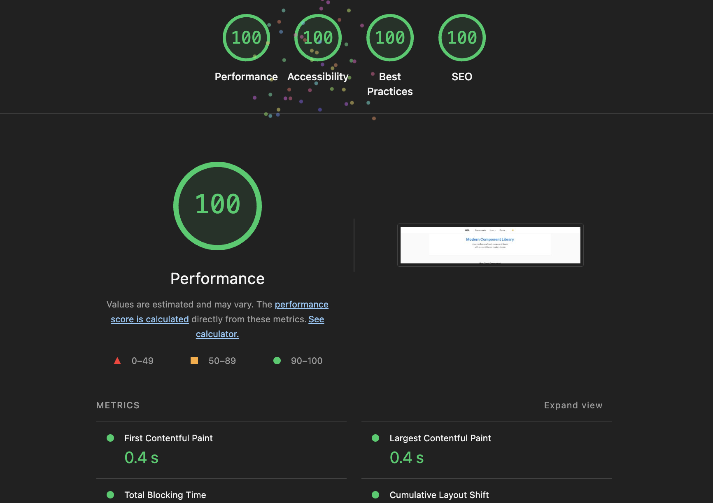
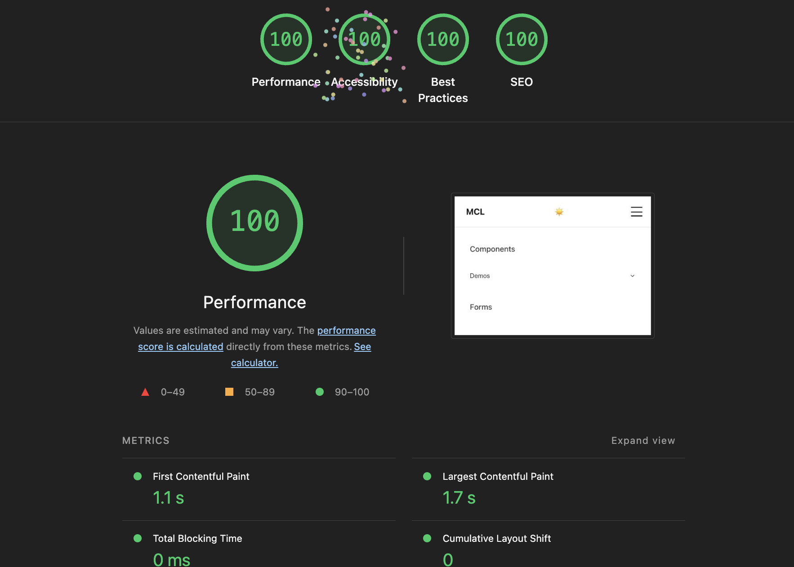
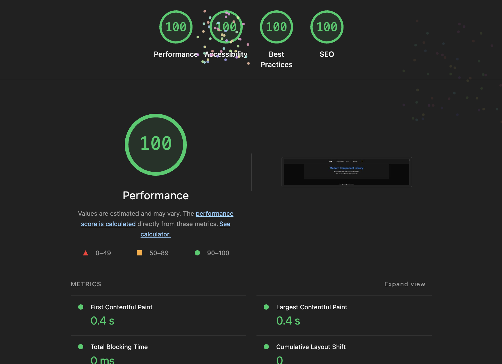
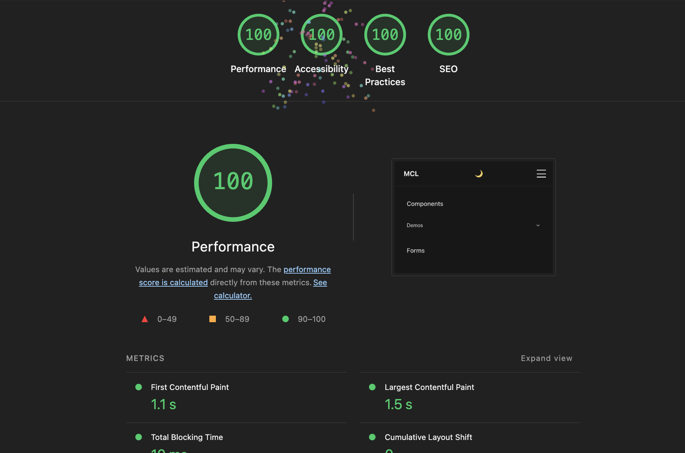

# Modern React Component Library Training App

A comprehensive React training application built with Create React App that demonstrates modern React concepts, accessibility best practices, and interactive components. This project serves as both a functional component library and an educational resource for learning React development.








## 🚀 Project Overview

This training application showcases a complete modern React ecosystem including:

- **Interactive component demonstrations** with live examples
- **Accessibility-first development** following WCAG 2.1 AA standards
- **Modern styling approach** using CSS Modules and SCSS
- **Performance optimization** with React hooks and memoization
- **Advanced data visualization** with sortable Chart.js integration
- **Image optimization** with WebP conversion and responsive loading
- **Theme management** with light/dark mode support
- **Real-time components** like live clocks and interactive charts
- **Comprehensive chart export** with PNG and PDF generation
- **Responsive design** optimized for all device sizes

## 🛠️ Technologies & Libraries Used

### Core Technologies
- **React 19.1.0** - Modern React with latest features
- **Create React App** - Zero-configuration build setup
- **JavaScript (ES6+)** - Modern JavaScript syntax and features

### UI & Styling
- **CSS Modules** - Scoped styling with `.module.scss` files
- **SCSS/Sass** - Enhanced CSS with variables and mixins
- **CSS Custom Properties** - Runtime theming and dynamic styling
- **BEM Methodology** - Scalable CSS architecture

### Data Visualization
- **Chart.js** - Interactive and responsive charts
- **react-chartjs-2** - React wrapper for Chart.js integration

### Icons & Assets
- **React Icons (Feather Icons)** - Lightweight SVG icon library
- **UI Avatars** - Dynamic avatar generation service
- **Sharp** - High-performance image processing for optimization
- **WebP Image Format** - Modern image format for better compression

### Development Tools
- **ESLint** - Code quality and consistency
- **Sass Loader** - SCSS compilation and processing
- **Image Optimization Scripts** - Automated WebP conversion and resizing

## 📁 Project Structure

```
src/
├── components/           # Reusable UI components
│   ├── Button/          # Modern button component with variants
│   ├── Card/            # Flexible card component system
│   ├── Chart/           # Chart.js wrapper components
│   ├── Clock/           # Live time display component
│   ├── Form/            # Complete form component system
│   ├── Footer/          # Application footer
│   ├── Modal/           # Accessible modal dialogs
│   ├── Nav/             # Navigation component
│   ├── Section/         # Content section wrapper
│   ├── TeamSalesChart/  # Interactive sales dashboard (modular architecture)
│   │   ├── components/  # Sub-components for smart avatars and chart elements
│   │   ├── data/        # Team member data and avatar utilities
│   │   ├── constants/   # Chart configuration and color schemes
│   │   └── TeamSalesChart.jsx # Main component
│   └── ThemeToggle/     # Theme switching component
├── config/              # Application configuration
│   ├── company.js       # Company information
│   ├── demo.js          # Demo content and settings
│   ├── forms.js         # Form configuration
│   └── navigation.js    # Navigation structure
├── contexts/            # React context providers
│   └── ThemeContext.jsx # Theme management
├── hooks/               # Custom React hooks
│   ├── demo/            # Demo-specific hooks
│   └── useOptimizedImage.js # Optimized image loading hook
├── styles/              # Global styles and themes
│   ├── base.scss        # Base styles and resets
│   ├── mixins.scss      # SCSS mixins for accessibility and responsive design
│   ├── themes/          # Light and dark theme definitions
│   └── utilities.scss   # Utility classes
├── utils/               # Utility functions
│   ├── salesData.js     # Sales data management and formatting
│   └── userData.js      # User data utilities
├── public/
│   ├── optimized/       # WebP optimized images
│   └── teamMembers/     # Original team member photos
└── scripts/
    └── convert-images.js # Image optimization automation
```

## 🎯 Key Features

### Component Library
- **Button Component**: Multiple variants (primary, secondary, success, danger, ghost, outline)
- **Card System**: Flexible cards with headers, bodies, footers, and actions
- **Form Components**: Complete form ecosystem with validation and accessibility
- **Modal System**: Accessible dialogs with focus management
- **Theme Toggle**: Seamless light/dark mode switching

### Interactive Demonstrations
- **Live Clock**: Real-time clock with timezone support and modern design
- **Advanced Sales Dashboard**: Interactive Chart.js integration with:
  - **Sortable Data**: Sort by team member names (A-Z, Z-A) or performance values (Low-High, High-Low)
  - **Multiple Metrics**: Toggle between Current Month, Last Month, Target, and YTD views
  - **Chart Export**: High-quality PNG export with responsive sizing and PDF reports
  - **Performance Colors**: Dynamic color coding based on target achievement
  - **Responsive Charts**: Optimized viewing across all device sizes
  - **Modular Architecture**: Separated into reusable sub-components and data modules
- **Team Analytics**: Performance visualization with color-coded indicators and detailed member profiles
- **Smart Image System**: 
  - **WebP Optimization**: Automatic conversion with smart fallbacks
  - **Smart Avatar Component**: Intelligent image loading with fallback to generated avatars
  - **Performance Preloading**: Priority-based image loading for critical images
- **Form Demos**: Comprehensive form field examples with validation

### Accessibility Features
- **WCAG 2.1 AA Compliance**: All components meet accessibility standards
- **Enhanced Keyboard Navigation**: Full keyboard support with space/enter activation for sorting controls
- **Advanced Screen Reader Support**: 
  - Dynamic ARIA live regions for chart updates
  - Comprehensive chart descriptions with sort status
  - Contextual help text for all interactive elements
- **Focus Management**: Logical tab order and enhanced focus indicators with hover effects
- **Color Contrast**: High contrast ratios with theme-aware color systems
- **SEO Optimization**: Semantic markup with data attributes for analytics tracking

## 🚦 Available Scripts

### `npm start`
Runs the app in development mode at [http://localhost:3000](http://localhost:3000)

### `npm test`
Launches the test runner in interactive watch mode

### `npm run build`
Builds the app for production with optimized bundles

### `npm run build:prod`
Runs image optimization followed by production build

### `npm run optimize-images`
Converts images to WebP format and generates responsive versions

### `npm run eject`
**One-way operation** - Ejects from Create React App for full configuration control